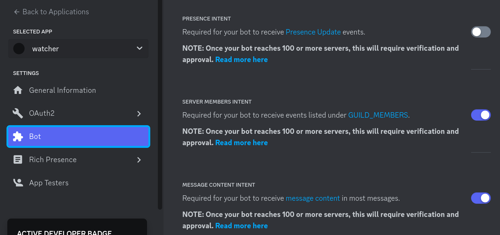
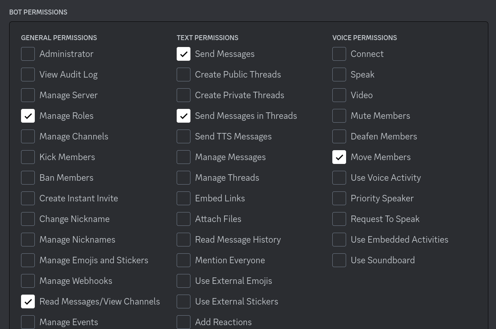

# watcher

Discord bot for self.dev community

## Running the project locally

### Project setup
```
# install dependencies
pip install -r requirements.txt

# make .env file from .env.example
cp .env.example .env

# run
python3 bot.py
```
Update the variables in `.env` manually

### Discord developer portal

#### Intents

#### Permissions
  
  


## Project structure
```
.
|- events
|    |- coworking.py # events related to coworking channels
|    |- cams_only.py # events related to cams_only channels
|- utils.py          # all the utility functions to keep it DRY.
|- env.py            # single source of env variables
|- bot.py            # main entrypoint

```
For contributing refer [CONTRIBUTING](https://github.com/selfdevs/watcher/blob/v1/CONTRIBUTING.md)

Contributors

- [Arth](https://github.com/probablyArth)
